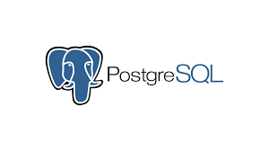

 

 

## Ibrahim Pala (ibrahimpala2019@gmail.com)

#

[About me](#about_me) | [Tech stack](#tech-stack) | [Projects](#projects) | [Skills](#skills) | [Education](#education) | [Experience](#experience) | [Interests](#interests)
 
 

 

## <a name="about_me">About me (in a nutshell) 😄</a> 

I am a disciplined and ambitious Full Stack Junior Developer, looking for a role where I can consolidate and extend my programming knowledge.

Alongside my studies in Biomedical Science at university, I have been working in technology sales whilst running my own Shopify and rent-to-rent businesses. After graduating with my bachelor's I started studying post-graduate medicine before deciding to take a career change to pursue my passion for coding. Although my interest in coding was apparent since a level's, it took me till my master's to realize a career around coding is where my passions and desires lie. After spending time working on my coding and problem-solving skills, I enrolled in makers academies' intensive 16-week Bootcamp to learn coding to an industry level and make my dreams come true.

## <a name="tech-stack">Tech stack 🔧</a> 

&nbsp;&nbsp;&nbsp;&nbsp;&nbsp;&nbsp;&nbsp;&nbsp;&nbsp;&nbsp;&nbsp;&nbsp;&nbsp;&nbsp;&nbsp;&nbsp;&nbsp;&nbsp;&nbsp;&nbsp;&nbsp;&nbsp;&nbsp;&nbsp;&nbsp;&nbsp;&nbsp;&nbsp;&nbsp;&nbsp;&nbsp;&nbsp;&nbsp;&nbsp;&nbsp;&nbsp;&nbsp;&nbsp;&nbsp;&nbsp;

- Javascript (Node.js, Express, Jest, Handlebars, React, React Native)
- Ruby (Sinatra, RSpec, Capybara)
- SQL (PostgreSQL, TablePlus)
- MongoDB (MongoDB Atlas, Mongoose)
- HTML, CSS (Boostrap)
- Heroko
- Git, GitHub

## <a name="projects">What I've been working on (Projects) 👨🏻‍💻</a>
| Name                         | Description       | Tech/tools        |
| ---------------------------- | ----------------- | ----------------- |
| [My-website](https://github.com/IbrahimPala1/personal-website) | My very own persoanl portfolio website. Check it out! | React, Javascript , SCSS, Netify |
| [AceBook](https://github.com/IbrahimPala1/acebook-node-priceless)| A facebook clone | MongoDB, Express, Node.js, Handlebars, Jest, Cypress             |
| [Loyal-Bean](https://github.com/IbrahimPala1/bean-app) | Two mobile applications (for independent coffee shop owners and customers respectively) to replace physical loyalty cards | React Native, Node.js, Express, MongoDB Atlas, Heroku, Android Studio, XCode              |
| [MakersBnB](https://github.com/IbrahimPala1/makersbnb)| An AirBnB clone that allows users to list spaces that they have available and to hire spaces for the night  | Ruby, Postgresql, RSpec|

## <a name="education">Education 📚</a>
#### Makers Academy (04/2022 to 08/2022)
- Frequently utiliased pair programming in order to problem solve effeciently, requiring teamwork and communication.
- Built three different projects working in agile teams, focused on following the MVP model and Test-driven-development process.
- Used Ruby and Javascript to practice object oriented desgin and build numerouse small applications using the process. 
- Learnt RSpec and Jasmine testing tools to Test drive small applications and group projects.
- In only two weeks, learnt react-native from scratch and built two mobile applications that interact via a backend and deployed the apps onto an ios and andriod phone. 

#### University of Hertfordshire (09/2021 to 04/2022)

- Master of Science (Physician Associate)

#### Middlesex University (09/2018 to 07/2021)

- Bachelor of Science (Biomedcial science)
- 2:1
- Led my own society designed to create a comfortable space for students to ask for help and build relationships. 

## <a name="experience">Where I've been contributing (Experience) 👨🏻‍💼</a>

**Company Name** (Sep.2022)  
_Elsevier • Software engineering work experience_

- Reviewed feedback from the QA engineer and corrected code.
- Fixed bugs and submitted pull requests for review.
- I gained further experience of what working in an agile team consists of.
- Learnt Elseviers engineering processes and the importance of different roles in an agile team. 
- Attended retros, stand-ups, and weekly reviews with the engineering team to update on progress and plan future steps.

**Company Name** (Aug.2017 – Sep.2021)  
_Dixons Carphone • Tech Sales Consultant_

- Managing my own team of 12 colleagues, on the shop floor, to increase
colleague motivation via group team talks and frequent individual
performance discussions throughout the day, resulting in sales targets being
met, and customers served in an organised manner.
- Managed an order and collect team of 15 colleagues during the Covid-19
pandemic, all processes and operations were upheld resulting in 100%
success rate and store cash bonus unlocked.
- Attending meetings on behalf of the store to discuss performance 
improvements in areas such as broadband, B2B business and care and
support(insurance)

**Company Name** (Jul.2019 – Mar.2020)  
_Mazrui property Development • Rent to rent PD_

- Negotiated with landlords and estate agents to secure rent to rent
contracts, giving me and my team full access of several properties
- Advertised available properties online, resulting in successfully attracting
customers.
- Helped increase business profitability by 40% due to exceptional
performance in a short period of 4 months.

## <a name="skills">What I bring to the table (Skills) 🔥</a>

**Excellent communicator and team player**
- In the Makers Bootcamp, pair programming and teamwork was an daily process for me. I worked on 3 engineering projects in teams consisting of 4-6 members which required constant collaboration and teamwork. We rotated pairs every day within the team and had frequent stand-ups to update the team on progress and overcome any obstacles a team member may have. Before the engineering projects, I would spend every day pairing with a new partner to learn TDD, the web, databases, javascript, and ruby. This exposure to constant pairing and teamwork has drastically built on my team working and communication skills; particularly in an engineering team environment.

- Having worked in technology sales for 4 years I would spend all day communicating with team members and customers. As a team leader, I would have to keep the morale and motivation of colleagues high to obtain optimal performance out of the team while ensuring customers are happy. I would lead morning stand-ups and team talks which would considerably contribute to boosting colleague motivation. Working in a role-based around constant teamwork and communication with customers has perfected my team-working and communication skills which I believe would be an asset to any organization. 

**Attention to detail and analytical skills** 
- In my post-graduate medical studies, I would take a patient's history and symptoms to come up with a diagnosis. Furthermore, I would evaluate laboratory results to rule out certain conditions. A simple mistake could have fatal consequences to a patient's well-being therefore having excellent attention to detail and analyzing data accurately was crucial. The pressure of not having the space to make mistakes has made me excellent in analytical thinking and taking additional attention to detail.

- My undergraduate studies consisted of frequent laboratory experiments. During these experiments, I would undergo complex biomedical procedures such as DNA sequencing, Blood grouping, and biochemical testing which required excellent attention to detail and analytical skills. The smallest of mistakes could result in misdiagnoses, leading to the failure of an experiment. Furthermore, I would analyze and evaluate the results obtained from the experiments using graphs and diagrams. These experiments and constant evaluation of data have significantly contributed to my analytical thinking skills and attention to detail skills.

**Fast learner and Time-management**
- During my time at makers, I took on the ambitious challenge of building a coffee loyalty app using react native and deploying it onto a mobile phone. I had no prior knowledge of react native or how to deploy an app onto a mobile phone, so had to teach myself the new language and build the app in only two weeks. Through excellent time management and quick learning skills, I was able to learn the language, build two apps for mobile and have time to add additional features such as a QR code scanner.

**Thrives under pressure**
- Working in technology sales was a fast-paced and high-pressure environment. Throughout covid, staff including management would frequently un-attend work due to illness or fear of vulnerability. As a result, I was given the responsibility to lead my department. Before I took over, low staff numbers and high customer demand created an overwhelming and frustrating environment. To solve this I introduced a queuing system, in which I would reassure customers and direct them to the next available colleague in an organized and timely manner. Using this strategy I was able to diminish customer frustration and take the pressure off my team. As a result, my team received the highest customer satisfaction and performed above expectations in terms of API targets. 

- My post-graduate studies involved frequent General Practice placements. On a particularly busy day, during a walk-in clinic, two out of 3 GPs had not attended work as they had been diagnosed with covid. Patients began to feel increasingly frustrated and the GP was overwhelmed. Understanding the severity of the situation I decided to take ownership by dividing the patients into two groups depending on the urgency of their visit. I would direct the complicated cases to the GP whilst taking care of the simpler cases.  As a result, we avoided patients filing complaints and also avoided patients walking away without being seen.

 
## <a name="interests">When I'm not coding (Interests)</a>

- 📚 Reading: Just finished [Atomic Habits](https://www.amazon.co.uk/Atomic-Habits-Proven-Build-Break/dp/0735211299); a book about the effect small habits can have on productivity and achieving goals. A great investment and 10/10 would recommend it. 
- 🏞 Languages: Fluent in Turkish and currently in the pursuit of becoming fluent in Arabic.
-  ✈️ I love traveling around the world, learning about the history of the world, and understanding different cultures. 
-  🏋🏻‍♂️ Sports: From being a black belt in karate since the age of 11 to competing in amateur competitions for boxing and table tennis, I've always been a huge sports enthusiast. I make sure to exercise for at least 30 minutes every day.   
 
