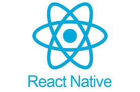

## Ibrahim Pala (ibrahimpala2019@gmail.com)

#

[About me](#about_me) | [Tech stack](#tech-stack) | [Projects](#projects) | [Skills](#skills) | [Education](#education) | [Experience](#experience) | [Interests](#interests)
 
 

 

## <a name="about_me">About me (in a nutshell) 😄</a>

I am a diciplined and ambitious Full Stack Junior Developer, looking for a role where I can consolidate and extend my programming knowledge.

Alongside my studies in Biomedical Science at university, I have been working in technology sales whilst running my own shopify and rent to rent businesses. After graduating from my bachelors i had started studying post-graduate medicine before deciding to take a carrer change to pursue my passion for coding. Although my interest for coding was apparent since a-leveles, it took me till my masters to realise a career around coding is where my passions and desires lie. After spending time working on my coding and problem solving skills, i enrolled onto makers academies intensive 16 week bootcamp to learn coding to an industry level and make my dreams come true. 

## <a name="tech-stack">Tech stack 🔧</a> 

&nbsp;&nbsp;&nbsp;&nbsp;&nbsp;&nbsp;&nbsp;&nbsp;&nbsp;&nbsp;&nbsp;&nbsp;&nbsp;&nbsp;&nbsp;&nbsp;&nbsp;&nbsp;&nbsp;&nbsp;&nbsp;&nbsp;&nbsp;&nbsp;&nbsp;&nbsp;&nbsp;&nbsp;&nbsp;&nbsp;&nbsp;&nbsp;&nbsp;&nbsp;&nbsp;&nbsp;&nbsp;&nbsp;&nbsp;&nbsp;

- Javascript (Node.js, Express, Jest, Handlebars, React, React Native)
- Ruby (Sinatra, RSpec, Capybara)
- SQL (PostgreSQL, TablePlus)
- MongoDB (MongoDB Atlas, Mongoose)
- HTML, CSS (Boostrap)
- Heroko
- Git, GitHub

## <a name="projects">What I've been working on (Projects) 👨🏻‍💻</a>
| Name                         | Description       | Tech/tools        |
| ---------------------------- | ----------------- | ----------------- |
| **MakersBnB**            | An AirBnB clone that allows users to list spaces that they have available and to hire spaces for the night  | Ruby, Postgresql, RSpec|
| **AceBook** | A facebook clone | MongoDB, Express, Node.js, Handlebars, Jest, Cypress             |
| **Loyal-Bean** | Two mobile applications (for independent coffee shop owners and customers respectively) to replace physical loyalty cards | React Native, Node.js, Express, MongoDB Atlas, Heroku, Android Studio, XCode              |

## <a name="education">Education 📚</a>
#### Makers Academy (04/2022 to 08/2022)
- Frequently utiliased pair programming in order to problem solve effeciently, requiring teamwork and communication.
- Built three different projects working in agile teams, focused on following the MVP model and Test-driven-development process.
- Used Ruby and Javascript to practice object oriented desgin and build numerouse small applications using the process. 
- Learnt RSpec and Jasmine testing tools to Test drive small applications and group projects.
- In only two weeks, learnt react-native from scratch and built two mobile applications that interact via a backend and deployed the apps onto an ios and andriod phone. 

#### University of Hertfordshire (09/2021 to 04/2022)

- Master of Science (Physician Associate)

#### Middlesex University (09/2018 to 07/2021)

- Bachelor of Science (Biomedcial science)
- 2:1
- Led my own society designed to create a comfortable space for students to ask for help and build relationships. 

## <a name="experience">Where I've been contributing (Experience) 👨🏻‍💼</a>

**Company Name** (Aug.2017 – Sep.2021)  
_Dixons Carphone • Tech Sales Consultant_

- Managing my own team of 12 colleagues, on the shop floor, to increase
colleague motivation via group team talks and frequent individual
performance discussions throughout the day, resulting in sales targets being
met, and customers served in an organised manner.
- Managed an order and collect team of 15 colleagues during the Covid-19
pandemic, all processes and operations were upheld resulting in 100%
success rate and store cash bonus unlocked.
- Attending meetings on behalf of the store to discuss performance 
improvements in areas such as broadband, B2B business and care and
support(insurance)

**Company Name** (Jul.2019 – Mar.2020)  
_Mazrui property Development • Rent to rent PD_

- Negotiated with landlords and estate agents to secure rent to rent
contracts, giving me and my team full access of several properties
- Advertised available properties online, resulting in successfully attracting
customers.
- Helped increase business profitability by 40% due to exceptional
performance in a short period of 4 months.

## <a name="skills">What I bring to the table (Skills) 🔥</a>

**Excellent communicator and team player**
- in the Makers bootcamp, pair programming and team-work was a daily process for me. I worked on 3 engineering projects in teams consisting of 4-6 members which required constant collobartion and team work. We rotated pairs everyday within the team and had frequent stand ups to update the team on progress and overcome any obstacles a team member may have. Prior to the engineering projects i would spend everyday pairing with a new partner to learn TDD, the web, databases, javascript and ruby. This exposure to constant pairing and team work has drastically built on my team working and communication skills; particually in an engineering team environment. 

- Having worked in technology sales for 4 years, i would spend all day communicating with team members and customers effectively in order to meet sales targets and build the trust and loyalty of customers. 

**Attention to detail and analytical skills**
- In my post-graduate medical studies i would take patient history and symptoms in order to come up with a diagnoses. Furthermore i would evelauete laboratory results to rule out certain conditions. A simple mistake could have fatal consequences to patients well-being therefore having excellent attention to detail and analysing data accurately was crucial. The pressure of not having the space to make mistakes has made me excellent in analytcial thinking and taking on additional attention to detail. 

 
**Fast learner and Time-management**
- During my time at makers i took on the ambitiouse challenge of building a coffee loyalty app using react native and deploying it onto a mobile phone. I had no prior knowledge of react native or how to deploy an app onto a mobile phone, so had to teach myself the new language and build the app in only two weeks. Through excellent time-managment and quick learning skills i was able to learn the language, build two apps for mobile and have time to add additional features such as QR code scanner.
- 

**Thrives under pressure**
- Working in technology sales was a fast paced and high pressure environment. Throughout covid, staff including management would frequently unattend work due to illness or fear of vulnerability. As a result i was given the responsbility to lead my department. Prior to me taking over, low staff numbers and high customer demand created an overwheming and frustrating environemnt. To solve this i introduced a queing system, in which i would reassure customers and direct them to the next availble colleague in an organised and timely manner. Using this strergy i was able to diminish customer frustration and take pressure of my team. In result my team had recieved the highest customer satisfaction and performed above targets in terms of api targets. 

- My post-graduate studies involved frequent General Practice placements. In a partcualryl busy day, during a walk in clinic, two out of 3 GP's had not attened work as they had been diagnosed with covid. Patients began to feel increasingly frustrated and the GP was overhwklmed. Understanding the severity of the situation i decided to take ownership by dividing the patients in two groups depending on the urgency of their visit. I would direct the compliated cases to the GP whilst taking care of the simpler cases.  As a result we avoided patients filing complaints and also avoided patients walking away without being seen. 

-STAR
-What was the situation/task? (ST)

-How was the skill used?

-What did you do? (action)

-What was the result?

 
## <a name="interests">When I'm not coding (Interests)</a>

- 📚 Reading: Just finished https://www.amazon.co.uk/Atomic-Habits-Proven-Build-Break/dp/0735211299; a book about the effect small habits can have on productivity and achieving goals. A great investment, 10/10 would recommend. 
- 🏞 Languages: Fluent in Turkish and currently on the pursuet on becoming fluent in arabic.
-  ✈️ I love travelling around the world, learnng about history of the world and understanding different cultures. 
-  🏋🏻‍♂️ Sports: From being a balck belt in karate since the age of 11 to competing in ameteaur competions for boxing and table-tennis, ive always been a huge sports enthusiast. I make sure to exercise at least 30 minutes eveyrday.   
 
